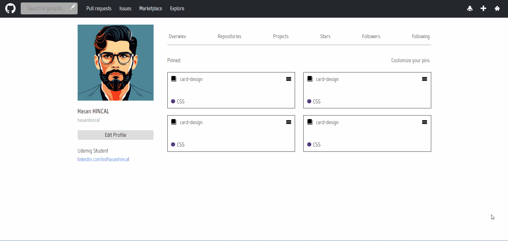

<h1>GitHub-profile-clone</h1>

 A GitHub profile clone website’s purpose is to showcase a developer’s coding skills and design abilities by replicating the look and functionality of their GitHub profile.

<h2>Technologies used in the project</h2>

Codded in HTML5, CSS3 and SCSS

<h2>Screen Gif</h2>

